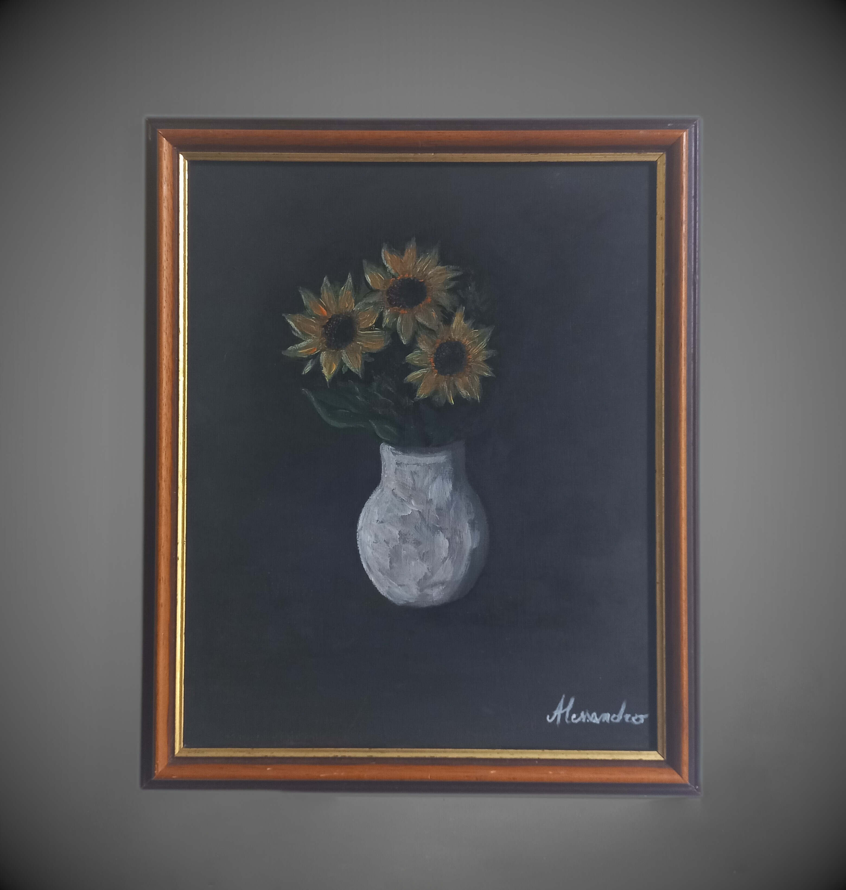
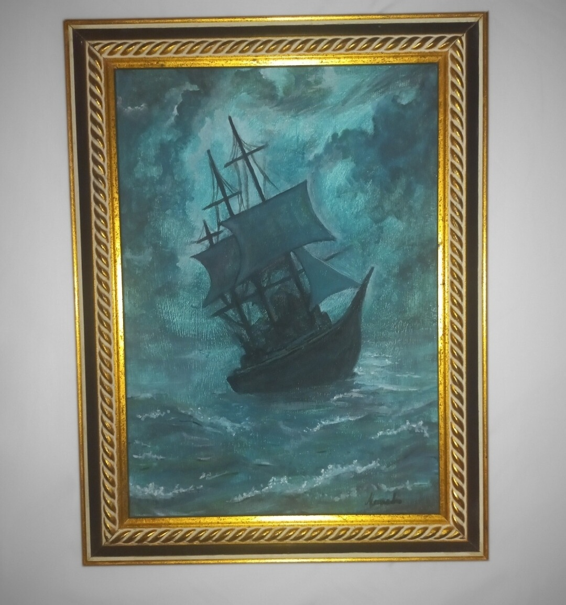
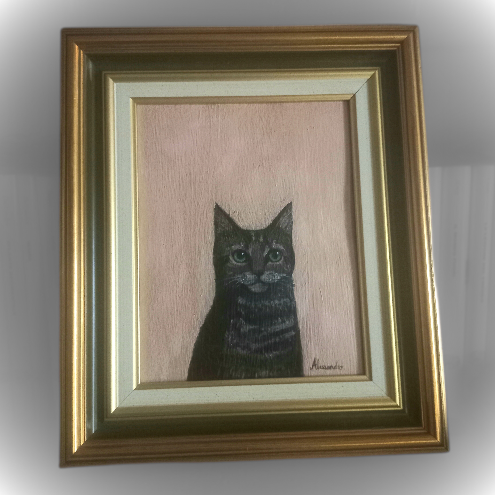

# Acrylics

Acrylic paint is made from three main elements: pigment, water, and an acrylic polymer that acts as a binder.
When the water evaporates, the polymer forms a thin, flexible film that holds the colour in place.  

This page gathers some of my acrylic works.

---

## Gallery

*Sunflowers* - May 19, 2025

*Through the Storm* - July 13, 2025

*Dakota* - August 14, 2025 

---

## About this medium

What I appreciate most about acrylic paint is its **fast drying time** — it allows me to work in layers and experiment freely with colours and textures.  
Acrylics make it possible to move quickly between ideas and to build up depth.

Some of the painters who inspire me most are [Vincent van Gogh](https://en.wikipedia.org/wiki/Vincent_van_Gogh), [Claude Monet](https://en.wikipedia.org/wiki/Claude_Monet), and [Théodore Gudin](https://en.wikipedia.org/wiki/Th%C3%A9odore_Gudin).

---

[← Back to Home](index.md)
