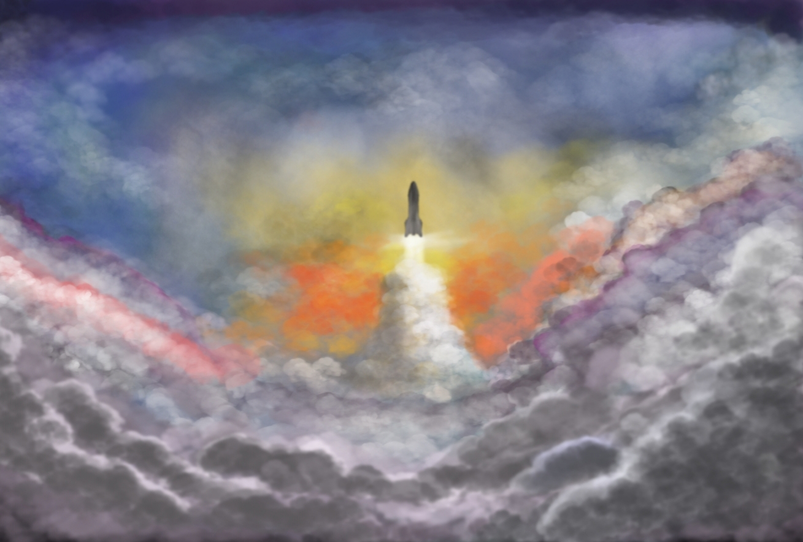
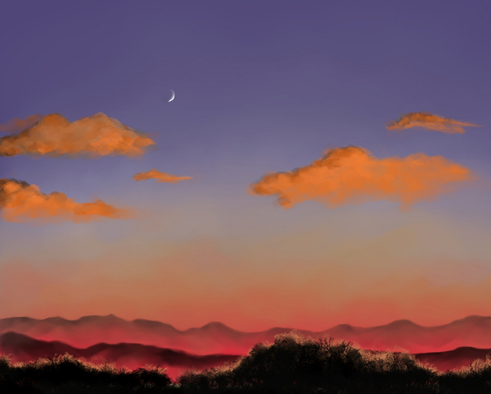
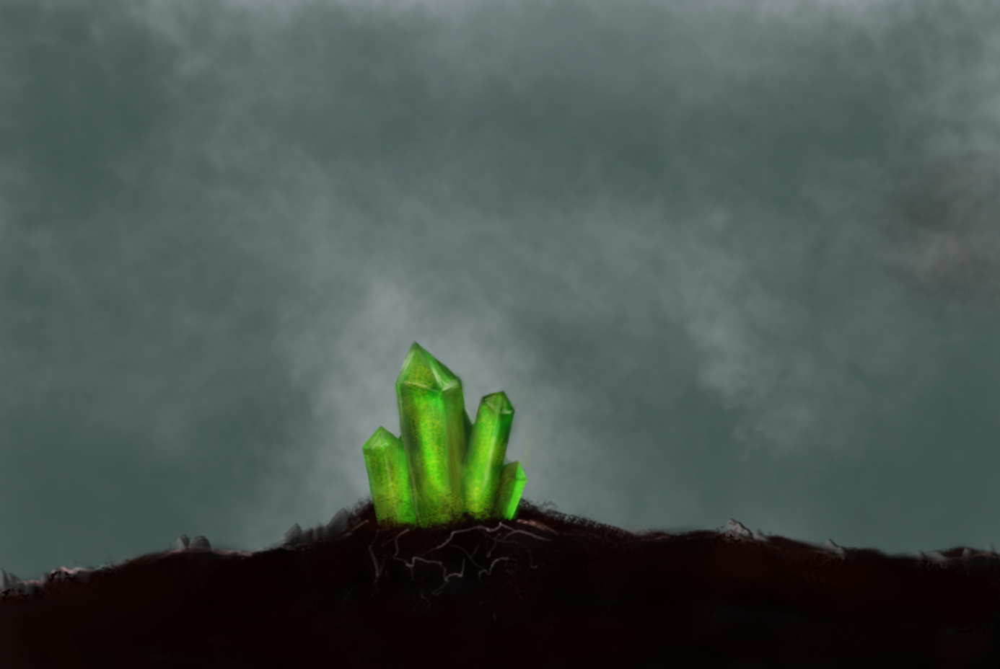

# Digital Painting

Digital painting allows me to explore light and composition in a different way.  
This page gathers some of my digital works.

 

---

## Gallery

 

*Beyond the clouds* - December 4, 2021

 

*The Land of Peace* - December 8, 2021

 

*Emerald* - December 4, 2021

 

---

## About this medium

I create most of my digital paintings using [Krita](https://krita.org/en/), an open-source software designed for artists.

 

What I enjoy most about digital painting is the **feeling of total freedom**, I can explore, adjust, and transform my work endlessly.  
There is also a comforting sense of **being allowed to make mistakes**, knowing that nothing is permanent and everything can be revised.

   

---

[← Back to Home](index.md)
